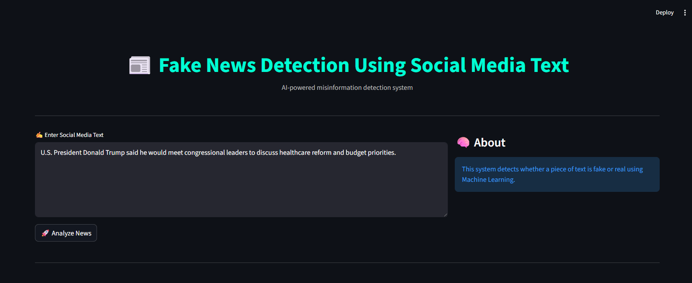
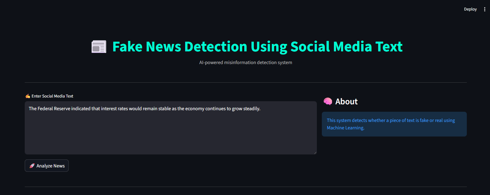
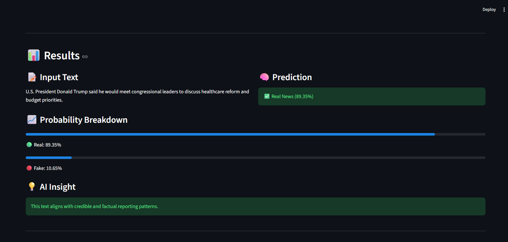
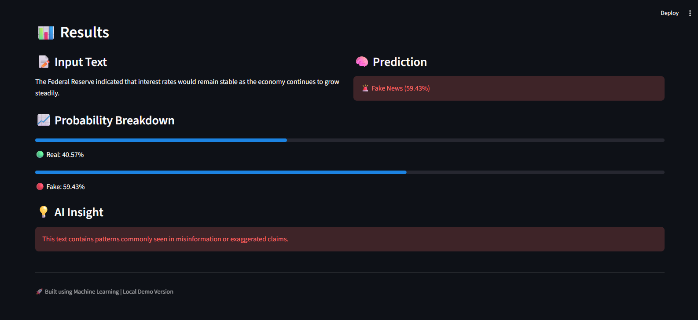

# Fake News Detection Using Social Media Text

> An AI-powered system that classifies social media content as **Real** or **Fake** using Machine Learning and NLP — with confidence scoring and uncertainty handling.

[](https://python.org)
[](https://scikit-learn.org)
[](https://streamlit.io)
[](#-model-details)
[](LICENSE)

[**🚀 Live Demo**](https://your-demo-link.streamlit.app) · [**📊 Dataset**](https://www.kaggle.com/datasets/emineyetm/fake-news-detection-datasets?resource=download) · [**🐛 Report Bug**](https://github.com/aflumk2003/issues)

---

## Overview

With the rapid spread of misinformation across Twitter, Facebook, and WhatsApp, verifying content at scale has become critical. This project uses a TF-IDF + Logistic Regression pipeline to analyze the linguistic patterns of social media text and output a credibility verdict in milliseconds.

```
Raw Text  →  Preprocessing  →  TF-IDF Vectorization  →  ML Classifier  →  Verdict + Confidence Score
```

**Output classes:**

| Label | Meaning | Trigger |
|:------|:--------|:--------|
| ✅ Real News | Credible content | Confidence ≥ 65% (Real) |
| 🚨 Fake News | Misinformation detected | Confidence ≥ 65% (Fake) |
| 🤔 Uncertain | Low-confidence prediction | Confidence < 65% either way |

---

## Screenshots

### Input Interface

**Real news example** — text input and analysis trigger:



**Fake news example** — same interface with different content:



---

### Results View

**Real News Detection** — high-confidence credible result (89.35%):



- Prediction card shown in **green** with confidence percentage
- Probability bars: Real 89.35% vs Fake 10.65%
- AI Insight: *"This text aligns with credible and factual reporting patterns."*

---

**Fake News Detection** — flagged misinformation (59.43%):



- Prediction card shown in **red** with confidence percentage
- Probability bars: Real 40.57% vs Fake 59.43%
- AI Insight: *"This text contains patterns commonly seen in misinformation or exaggerated claims."*

---

## Features

- **Text Classification** — Paste any tweet, post, or article and get an instant verdict
- **Confidence Scoring** — Probabilistic Real vs Fake percentage breakdown
- **Uncertainty Handling** — Low-confidence inputs are flagged rather than forced into a binary result
- **Visual Dashboard** — Color-coded prediction card + probability bar chart rendered live in Streamlit
- **AI Insight Panel** — Human-readable explanation of the prediction
- **Fast Inference** — Sub-second predictions after model load

---

## Model Details

| Parameter | Value |
|:----------|:------|
| Algorithm | Logistic Regression (L2 regularization) |
| Vectorizer | TF-IDF with n-gram range `(1, 3)` |
| Max Features | 50,000 |
| Confidence Threshold | 65% |
| Training Accuracy | ~99.1% |
| Validation Accuracy | ~98.7% |

**Preprocessing steps:**
1. Lowercase conversion
2. URL, HTML tag, and special character removal
3. Whitespace normalization

---

## Dataset

Trained on the [Fake News Detection Dataset](https://www.kaggle.com/datasets/emineyetm/fake-news-detection-datasets?resource=download) from Kaggle:

| File | Label | Articles |
|:-----|:------|:--------:|
| `True.csv` | Real News | 21,417 |
| `Fake.csv` | Fake News | 23,481 |
| — | **Total** | **44,898** |

> 🔗 **Download:** [kaggle.com/datasets/emineyetm/fake-news-detection-datasets](https://www.kaggle.com/datasets/emineyetm/fake-news-detection-datasets?resource=download)

---

## Project Structure

```
fake-news-detector/
│
├── app.py              # Streamlit web application
├── train.py            # Model training script
├── model.pkl           # Serialized trained model
├── vectorizer.pkl      # Fitted TF-IDF vectorizer
│
├── dataset/
│   ├── True.csv
│   └── Fake.csv
│
├── screenshots/
│   ├── True_1.png      # Input screen — real news
│   ├── True_2.png      # Results screen — real news
│   ├── Fake_1.png      # Input screen — fake news
│   └── Fake_2.png      # Results screen — fake news
│
├── requirements.txt
└── README.md
```

---

## Installation & Setup

**1. Clone the repository**

```bash
git clone https://github.com/aflumk2003/fake-news-detector.git
cd fake-news-detector
```

**2. Install dependencies**

```bash
pip install -r requirements.txt
```

**3. Add the dataset**

Download from Kaggle and place `True.csv` and `Fake.csv` in the project root.

**4. Train the model**

```bash
python train.py
```

> Generates `model.pkl` and `vectorizer.pkl` — takes ~30–60 seconds.

**5. Run the app**

```bash
python -m streamlit run app.py
```

Open `http://localhost:8501` in your browser.

---

## How It Works

**Step 1 — Input**
User pastes a social media post, tweet, or news snippet into the app.

**Step 2 — Preprocessing**
Text is lowercased, URLs and special characters are stripped, and whitespace is normalized.

**Step 3 — Vectorization**
TF-IDF transforms the cleaned text into a high-dimensional sparse feature vector, weighting words and phrases by their importance relative to the training corpus.

**Step 4 — Classification**
Logistic Regression outputs `P(Fake)` and `P(Real)`. If neither probability exceeds the 65% confidence threshold, the result is flagged as Uncertain.

**Step 5 — Display**
Streamlit renders a color-coded verdict card (green for Real, red for Fake), probability breakdown bars, and an AI Insight explanation.

---

## Limitations

- Trained primarily on US political news — may underperform on Indian, tech, or sports content
- Cannot detect sarcasm, satire, or culturally specific irony
- Model knowledge is static; it does not update with new events after training
- Very short texts (< 20 words) tend to produce lower-confidence results

---

## Roadmap

- [ ] Upgrade to BERT / RoBERTa for contextual understanding
- [ ] URL input — auto-fetch and analyze full articles
- [ ] Explainable AI — highlight the words driving each prediction
- [ ] Real-time news API integration
- [ ] Multilingual support

---

## Tech Stack

Python · Scikit-learn · Pandas · NumPy · Streamlit

---

## Contributing

Fork the repo, create a branch, make your changes, and open a pull request. All contributions are welcome.

---

## License

MIT License — free for educational and personal use.

---

**Author:** [Aflah](https://github.com/aflumk2003) · ⭐ Star this repo if it helped you
